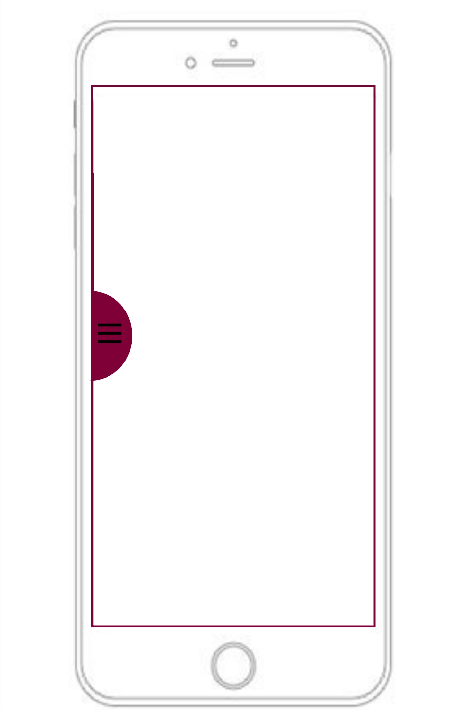

# Website Assignment - Swat-Valley
## MY Website 
My website is about a place in Pakistan called Swat which is very well known in the country. My aim with this website is to showcase the city online and for the public to see and gather information about it. My website is made of off five main pages these are: 
* index.html (home)
* history.html
* culture.htnl 
* tourism.html
* locations.html

I also have other html pages but they are only applied to the Tourism webpage.

## Responsive 
The webiste is responsive and so changes it's appearance according to the size of the screen it is viewd on. The website is made mobile first and then desktop. The desktop designs also apply to tablets as i did not want to create a seprate design for tablets and the desktop design is suitable for viewing on tablets. 

### Below i have both the mobile and desktop wireframes for all the pages.

###Note: As you can see these images are coming out very big if i include all the wireframes in this file they will take you forver to get to the bottom. I have resized the images too but they still dont seem to fix the issue so to resolve this problem i have left all the wireframes in a seprate folder in my repositry.SCROLL DOWN to read about my designs.

###Mobile-First 
The mobile Navigation is styled in css and uses javascript to open up from the side when a user taps on the icon on the left hand side. The footer is simple here only includes some text which is centered. When the Navigation opens up it has a few links to other of my pages and also includes the social media links through the social media icons. This theme stays for all the five main pages.

The colours and stay the same throught the webpages but the sizes change to be smaller for mobile size because of the smaller screen size.

images and sections change their positioning for the mobile size devices. This can be seen in the history and culuture page where the info stacks on top of the images and take up 100% width of the screen. Parallax scrolling is not fixed on mobile size devices becasue the phones i tested it on did not work and the images started to become out of proprtion. 

###Desktop/Tablet  
The navigation and footer for desktop changes here. The social media icons from the nav moves down to the footer and the navigaton links move to the top of the page. The theme is the same for all the main pages.

Parallax scrolling work on the desktop size devices and also sections where there is info and images or multiple div's alight next to each other horizontilly to take advantage of the screen size. 

##JavaScript in the website 

###Navigation and Clocks 
Java Script has been used a couple of times in my website the first instance which i used it was for the navigation for the mobile size screens. Another instance when i used the Navigation was for the clocks for the local time and also for the time in Pakista swat. 

###Night mood in Tourism page
Night and day mood, i used the javascript to change the colours of the page to accomadate for them late night internet surfers. The way it works is you click on th night/day button and it gives you the option to put the night mood on or off. If you put put it on the colour of teh body changes to a darker colour and the text changes its colour to white.

###Googlemap 
The javascript for google map was used to load the area in pakistan when the page loaded and also to mark some of the locations.

##API
I used the google maps API for which i needed the google api key. I managed to get the key and added it in the HTML which enabled the google maps on my website.
